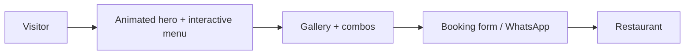

# La Bonta Ristorante

**Restaurant website with an interactive menu, gallery, table booking, four languages and WhatsApp ordering.**

    

**Live demo:** [https://jryahia.github.io/la-bonta-ristorante/](https://jryahia.github.io/la-bonta-ristorante/)

## Problem it solves

A restaurant site has to sell the atmosphere and make booking easy on a phone. This site does both as a fast static page with no backend to maintain.

Premium Italian restaurant website — an immersive static site with a dark glassmorphism, black-and-gold aesthetic, full multilingual support, and rich interactive features.

> **Demo live:** [https://jryahia.github.io/la-bonta-ristorante/](https://jryahia.github.io/la-bonta-ristorante/) — hosted on GitHub Pages

## Cosa offre il sito

- **Splash & hero immersivi** — animazioni Three.js in background, logo animato
- **Menu a cerchio interattivo** — 5 categorie che ruotano al passaggio del mouse
- **Modal menu con card dei piatti** — descrizioni e prezzi di ogni specialità
- **Combo speciali** — 4 menù con prezzi dinamici e configurabili
- **Galleria con lightbox** — esplorazione visiva della cucina e dell'ambiente
- **Prenotazione tavolo** — form con validazione e contatti diretti
- **Multi-lingua** — italiano / english / deutsch / français (i18n completo)
- **Posizione su mappa** — OpenStreetMap integrato, contatti e WhatsApp

## Perché questo sito

- **Statico, senza build step** — HTML, CSS e JavaScript vanilla in `public/`
- **Lusso coerente** — vetro scuro su nero puro (#000) con accenti oro (#C9A14A)
- **Mobile-first e responsive** — menù circolare e layout ottimizzati su ogni schermo
- **SEO ready** — meta description, semantica HTML, dati strutturati
- **Accessibilità** — navigazione da tastiera, contraste WCAG-aware
- **Prestazioni** — Three.js caricato in idle, CSS non bloccanti, zero CLS da immagini
- **Sicurezza** — CSP rigorosa senza `unsafe-inline`, SRI sulle risorse CDN, nessun `innerHTML` con dati utente

## Tecnologie

HTML5 · CSS3 · JavaScript (vanilla) · Three.js · Font Awesome · OpenStreetMap · i18n

## Deploy (Cloudflare Pages)

| Impostazione | Valore |
|---|---|
| Framework preset | None |
| Build command | *(vuoto)* |
| Build output directory | `public` |

Gli header di sicurezza (CSP, HSTS, X-Frame-Options, Permissions-Policy) sono in `public/_headers`.

In locale: `start.bat`, oppure `python -m http.server -d public`.

## Contatti attività

- +39 347 432 9466

---

*Vuoi un sito così per il tuo ristorante? [Contattami su LinkedIn](https://linkedin.com/in/yahya-jarray) · [GitHub](https://github.com/jryahia)*
